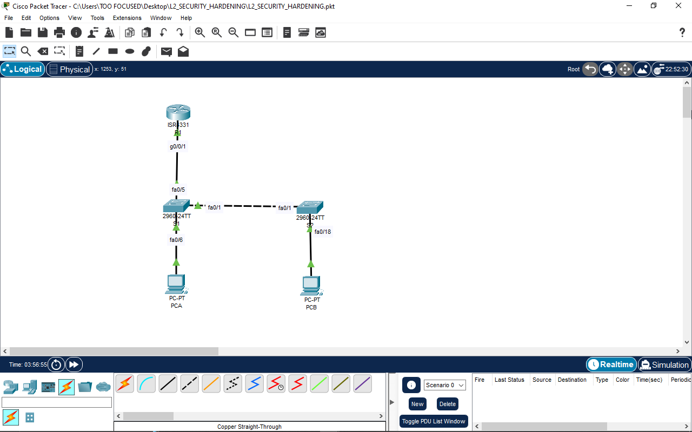
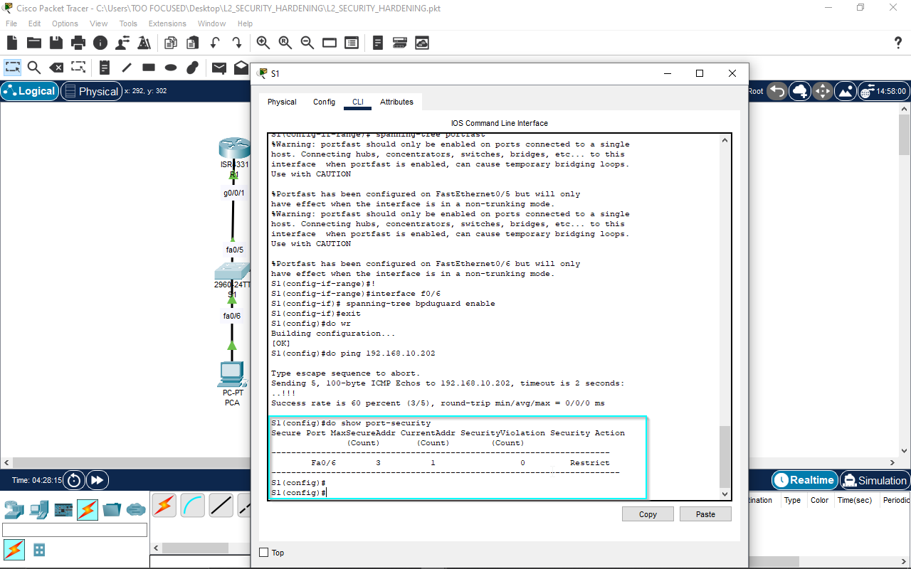
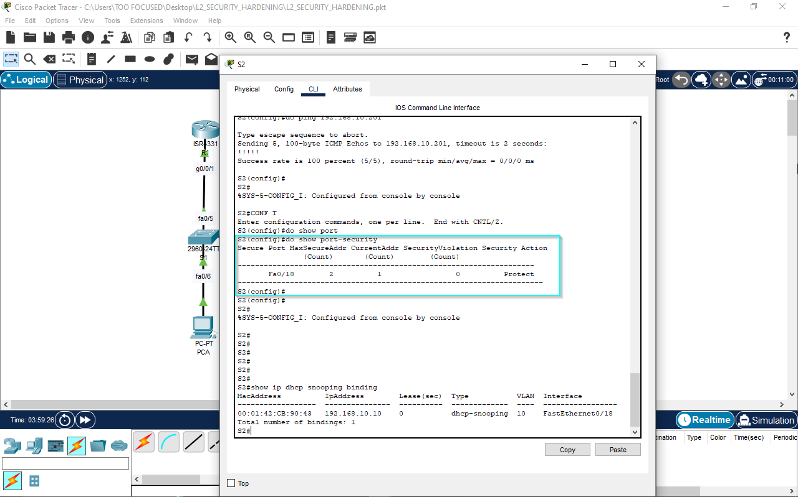
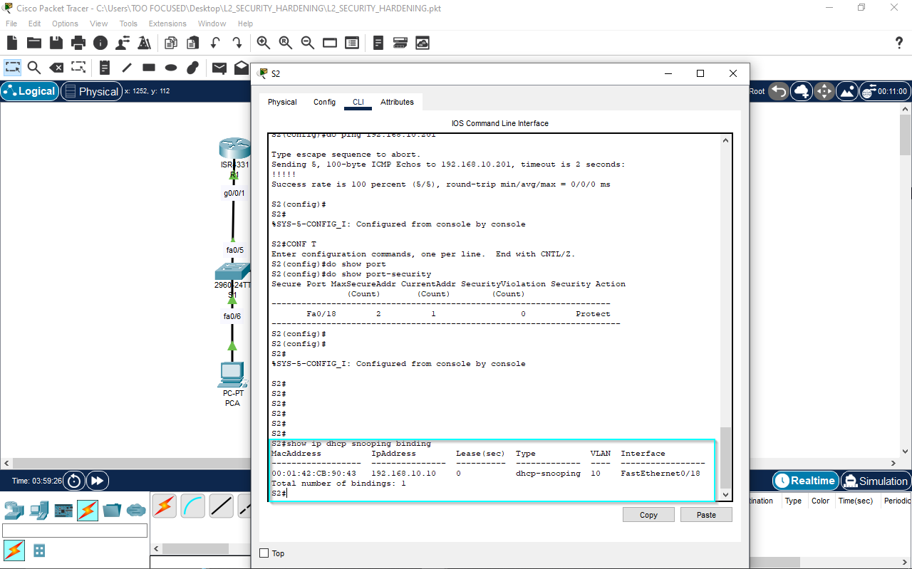

# Project: Hardening the Switched LAN - A Deep Dive into Layer 2 Security

## 1. Project Scenario & Objective
In any corporate network, the Layer 2 access layer is the frontline. It's where users connect, and it's often the most vulnerable part of the infrastructure. A default, out-of-the-box switch configuration is an open invitation for security threats, both malicious and accidental.

The objective of this project was to take a standard, unconfigured network and implement a multi-layered security strategy to harden the entire switched infrastructure. The goal was to move beyond basic connectivity and build an enterprise-ready, secure, and resilient access layer, demonstrating mastery of modern switch security best practices.

## 2. Network Topology

## 3. Key Security Features & Technologies Implemented
This project implemented a comprehensive suite of Layer 2 security features to create a defense-in-depth posture:

### Network Segmentation:

VLANs: Segmented the network into a Management VLAN (10), a Native VLAN (333), and a "Parking Lot" VLAN (999) for unused ports, ensuring traffic isolation.

### Trunk & Interface Security:

802.1Q Trunking: Manually configured trunk links and disabled the insecure DTP (Dynamic Trunking Protocol).

Non-Default Native VLAN: Mitigated VLAN hopping attacks by changing the native VLAN from the default of 1.

Unused Port Lockdown: All unused switchports were administratively shut down and moved to the "Parking Lot" VLAN to prevent unauthorized access.

### Port-Level Access Control:

Port Security: Implemented advanced port security on access ports to control which devices can connect to the network. This included:

MAC Address Sticky: Dynamically learning and locking MAC addresses to specific ports.

Violation Modes (restrict, protect): Configuring different responses to security violations.

MAC Address Aging: Configuring timers for learned MAC addresses.

### Threat Mitigation:

DHCP Snooping: Configured to prevent rogue DHCP servers from hijacking the network. This included defining trusted ports and implementing rate limiting.

PortFast: Enabled on all access ports to speed up convergence time for end-user devices.

BPDU Guard: Enabled on all PortFast-enabled ports to immediately shut down a port if it unexpectedly receives a BPDU from a rogue switch, preventing STP manipulation attacks.

## 4. Verification
The success of the project was verified through a series of show commands demonstrating each security feature's operational state, and by confirming full end-to-end connectivity for legitimate devices while ensuring all security policies were active.

